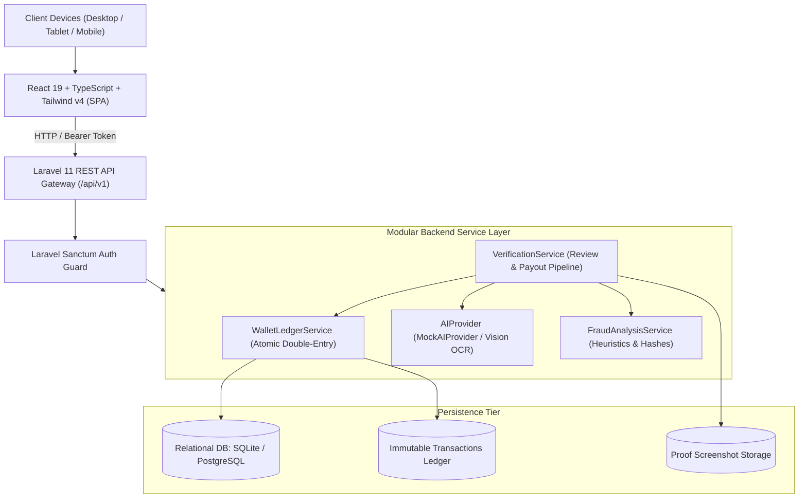

# BizNetwork System Architecture Specification

## 1. Architectural Overview

BizNetwork is constructed as a decoupled, modern multi-tier application designed for high throughput, sub-second API responses, absolute financial auditability, and role-segregated operations.

---

## 2. Core Subsystems

### 2.1 API & Routing Gateway
- **Base URL**: `/api/v1`
- **Sessionless Security**: Bearer token authentication via Laravel Sanctum.
- **Payload Standards**: JSON responses adhering to `{ success: boolean, data?: any, message?: string, errors?: any }`.
- **Throttling**: 60 req/min for general routes; 10 req/min for authentication and withdrawal submissions.

### 2.2 Financial Ledger Architecture (`WalletLedgerService`)
Financial integrity is guaranteed through:
1. **Integer Minor Units**: All monetary amounts are recorded in integer cents (`USD`), eliminating IEEE 754 floating-point rounding hazards.
2. **Database Transactions (`DB::transaction`)**: Every credit, debit, or reserve operation executes within an atomic database transaction with pessimistic locking (`lockForUpdate`).
3. **Immutable Double-Entry Auditing**: The `wallet_transactions` table retains sequential, immutable records capturing:
   - `wallet_id`
   - `type` (`credit`, `debit`, `hold`, `release`, `payout`, `refund`)
   - `amount_cents`
   - `balance_before_cents`
   - `balance_after_cents`
   - `idempotency_key` (prevents duplicate credit execution)
   - `reference_type` and `reference_id` (links back to task submission or withdrawal)

### 2.3 Verification & Fraud Pipeline
Proof submissions (screenshots + URL evidence) enter a multi-stage validation pipeline:
1. **Deduplication Check**: Computes perceptual hashes or checksums on submitted files and cross-checks with recent submissions across all accounts.
2. **Velocity & Timing Check**: Flags submissions submitted faster than 25% of the task's estimated duration.
3. **AI Vision & Heuristic Analysis (`MockAIProvider`)**:
   - Analyzes image dimensions, OCR text extraction, and social platform signature patterns.
   - Computes an automated confidence score (defaulting to 93% for valid matching proofs).
   - Generates structured tags (`social_post_detected`, `matching_account_handle`, `valid_timestamp`).
4. **Moderator Decisioning**:
   - Submissions meeting high-confidence thresholds can be auto-approved or surfaced in the Admin Verification Center.
   - Moderators review proofs side-by-side with campaign requirements and issue one-click decisions (`approve`, `reject`, `request_info`).

---

## 3. Data Integrity & Boundary Guarantees

| Boundary | Enforcement Mechanism | Failure Policy |
| :--- | :--- | :--- |
| **Zero Contributor Fees** | System settings & database rules forbid debiting contributors for registration or tier upgrades | Abort request with HTTP 403 Forbidden |
| **Balance Overdrafts** | `available_balance_cents >= requested_cents` check before debit | Abort with HTTP 422 Unprocessable Entity |
| **Duplicate Payouts** | Unique composite index on `(wallet_id, idempotency_key)` | Database duplicate key rollback |
| **Campaign Overspending** | Total reward reservations deducted from campaign escrow balance at task claim | Task claim rejected when campaign budget is depleted |

---

## 4. Scalability Strategy

- **Stateless Application Servers**: The Laravel API nodes maintain zero session state on disk; sessions and tokens reside in the database or Redis cache.
- **Queue Workers**: Heavy media processing, OCR calls, and email/webhook dispatches are routed to Laravel queue workers (`php artisan queue:work`).
- **CDN Offloading**: Frontend single-page application artifacts (`dist/`) are served via Cloudflare or AWS CloudFront with immutable asset caching.
