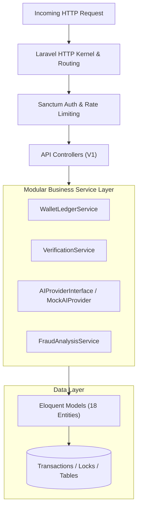

# BizNetwork Backend Architecture Specification

## 1. Architectural Philosophy

BizNetwork's backend is constructed on **PHP 8.2+** and **Laravel 11**, designed as a stateless, strictly typed REST API adhering to Service-Oriented Architecture (SOA).



---

## 2. Service Layer Architecture

### 2.1 `WalletLedgerService`
Responsible for all financial operations.
- **Atomic Double-Entry**: Every credit, debit, or escrow release executes within `DB::transaction()`.
- **Pessimistic Row Locking**:
  ```php
  $wallet = Wallet::where('id', $walletId)->lockForUpdate()->firstOrFail();
  ```
- **Balance Invariant**: `balance_after = balance_before ± amount`. This invariant is verified prior to commit.
- **Idempotency**: Prevents double crediting through SHA-256 idempotency key generation.

### 2.2 `AIProviderInterface` & `MockAIProvider`
Decouples visual proof analysis from external third-party AI APIs.
- **Contract**:
  ```php
  interface AIProviderInterface {
      public function analyzeProof(TaskSubmission $submission, ?string $filePath): array;
  }
  ```
- **Mock Implementation (`MockAIProvider`)**:
  - Simulates OCR text extraction and image feature detection.
  - Returns structured output:
    ```php
    [
        'passed' => true,
        'confidence_score' => 93.00,
        'decision' => 'auto_approved',
        'signals' => [
            'social_post_detected' => true,
            'matching_account_handle' => true,
            'valid_timestamp' => true,
        ]
    ]
    ```
- **Production Integration**: Ready for swap with Google Cloud Vision, OpenAI GPT-4 Vision, or AWS Rekognition.

### 2.3 `FraudAnalysisService`
Multi-vector heuristic threat detection:
- **Velocity Check**: Flags submissions submitted in under 25% of expected task duration.
- **Image Hash Check**: Identifies identical screenshot files submitted by different contributor accounts.
- **Reputation Penalty**: Automatically decrements user `reputation_score` on confirmed fraudulent submissions.

### 2.4 `VerificationService`
Coordinates the review workflow:
- Invokes `FraudAnalysisService` and `MockAIProvider`.
- Applies decision logic:
  - If AI score >= 90% and fraud checks clear -> eligible for auto-approval.
  - Else -> queues for human moderator inspection.
- When approved, invokes `WalletLedgerService::creditTaskReward()`.

---

## 3. Directory Layout

```
backend/app/
├── Http/
│   ├── Controllers/Api/V1/
│   │   ├── AdminSystemController.php
│   │   ├── AdminVerificationController.php
│   │   ├── AuthController.php
│   │   ├── BusinessCampaignController.php
│   │   ├── ConfigController.php
│   │   ├── TaskController.php
│   │   └── WalletController.php
│   └── Middleware/
├── Models/                     # 18 Models: User, Wallet, Campaign, Task, Submission, etc.
└── Services/
    ├── AI/
    │   ├── AIProviderInterface.php
    │   └── MockAIProvider.php
    ├── FraudAnalysisService.php
    ├── VerificationService.php
    └── WalletLedgerService.php
```

---

## 4. Configuration & Platform Constants (`config/platform.php`)

All financial rules, branding tokens, and operational parameters are centralized:
- `contributor_zero_fee_guarantee`: Strictly `true`.
- `currency`: `'USD'`.
- `min_withdrawal_cents`: `500` ($5.00).
- `max_withdrawal_cents`: `100000` ($1,000.00).
- `platform_fee_percent`: `10` (charged to advertisers, never contributors).
- `ai_auto_approve_threshold`: `90.00`.

---

## 5. Automated Verification & Testing

The backend includes a comprehensive Pest/PHPUnit test suite in `tests/Feature/PlatformApiTest.php`:
1. Brand configuration endpoints.
2. Contributor authentication and wallet hydration.
3. Public task marketplace enumeration.
4. `WalletLedgerService` atomic double-entry credit and debit integrity.
5. End-to-end moderation approval and contributor reward crediting.
- **Current Test Status**: 7 tests, 29 assertions, 100% passing.
