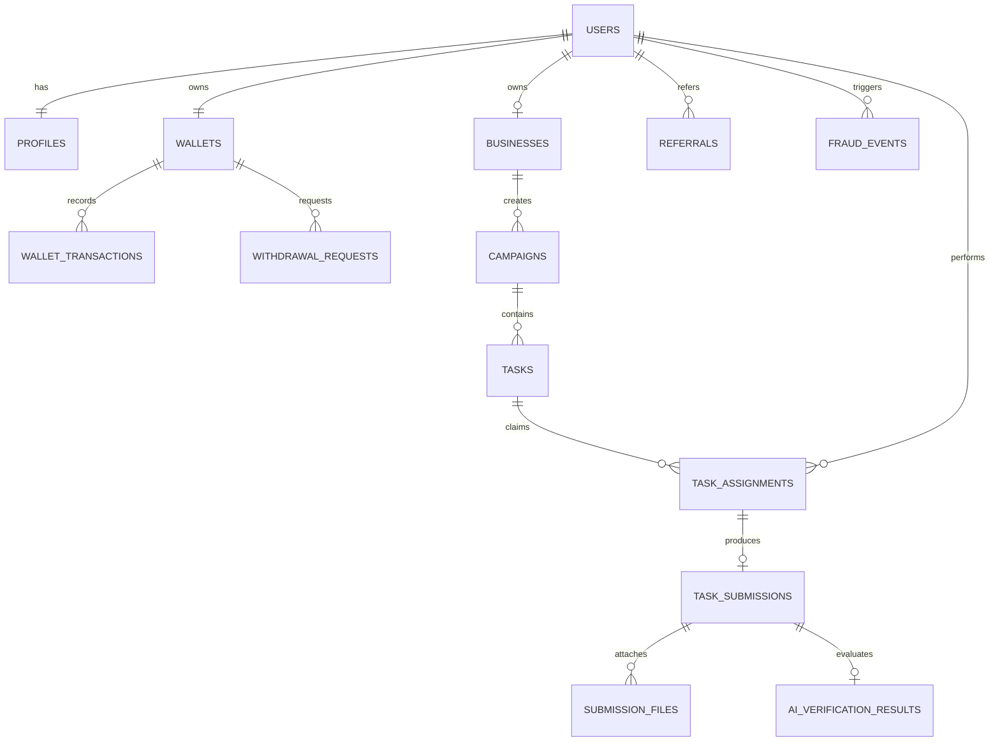

# BizNetwork Database Schema Specification

This document details the relational database schema of BizNetwork across all 23 database migrations. The schema is optimized for ACID compliance, referential integrity, double-entry auditability, and integer-based financial calculations.

---

## 1. Schema Conventions

- **Primary Keys**: Auto-incrementing unsigned `BIGINT` (`id`) with corresponding UUID string columns (`uuid`) for external exposure.
- **Foreign Keys**: Strongly typed with `cascadeOnDelete` or `nullOnDelete` where appropriate.
- **Monetary Storage**: Integer minor units (`_cents`) stored as `BIGINT`. For example, \$28.40 is stored as `2840`.
- **Timestamps**: All tables include standard `created_at` and `updated_at` timestamps.

---

## 2. Table Index & Relationships

---

## 3. Detailed Table Specifications

### 3.1 `users`
Core authentication and persona records.
- `id`: BIGINT (PK)
- `name`: VARCHAR(255)
- `email`: VARCHAR(255) UNIQUE
- `password`: VARCHAR(255)
- `role`: ENUM (`contributor`, `business`, `moderator`, `admin`, `superadmin`) DEFAULT `contributor`
- `status`: ENUM (`active`, `suspended`, `banned`, `pending_verification`) DEFAULT `active`
- `email_verified_at`: TIMESTAMP NULL
- `remember_token`: VARCHAR(100) NULL

### 3.2 `profiles`
Extended user biographical details and fraud metrics.
- `id`: BIGINT (PK)
- `user_id`: BIGINT (FK -> `users.id`)
- `country_code`: VARCHAR(2) (e.g. `US`, `AE`, `GB`)
- `phone`: VARCHAR(30) NULL
- `avatar_url`: VARCHAR(500) NULL
- `bio`: TEXT NULL
- `reputation_score`: INT DEFAULT 100
- `tasks_completed_count`: INT DEFAULT 0
- `tasks_rejected_count`: INT DEFAULT 0
- `total_earned_cents`: BIGINT DEFAULT 0

### 3.3 `businesses`
Brand and advertiser profile for campaign funding.
- `id`: BIGINT (PK)
- `user_id`: BIGINT (FK -> `users.id`)
- `company_name`: VARCHAR(255)
- `website`: VARCHAR(255) NULL
- `industry`: VARCHAR(100) NULL
- `billing_email`: VARCHAR(255)
- `verification_status`: ENUM (`unverified`, `verified`, `rejected`) DEFAULT `unverified`
- `balance_cents`: BIGINT DEFAULT 0

### 3.4 `task_categories`
Task taxonomy and organization.
- `id`: BIGINT (PK)
- `slug`: VARCHAR(100) UNIQUE
- `name`: VARCHAR(100)
- `icon`: VARCHAR(50) (Lucide icon identifier)
- `description`: TEXT NULL
- `is_active`: BOOLEAN DEFAULT TRUE
- `sort_order`: INT DEFAULT 0

### 3.5 `campaigns`
Business advertiser marketing campaigns holding escrow budgets.
- `id`: BIGINT (PK)
- `business_id`: BIGINT (FK -> `businesses.id`)
- `uuid`: VARCHAR(36) UNIQUE
- `title`: VARCHAR(255)
- `description`: TEXT
- `category_id`: BIGINT (FK -> `task_categories.id`)
- `budget_total_cents`: BIGINT
- `budget_remaining_cents`: BIGINT
- `reward_per_task_cents`: BIGINT
- `platform_fee_cents`: BIGINT
- `slots_total`: INT
- `slots_claimed`: INT DEFAULT 0
- `slots_completed`: INT DEFAULT 0
- `status`: ENUM (`draft`, `pending_funding`, `active`, `paused`, `completed`, `cancelled`) DEFAULT `active`
- `starts_at`: TIMESTAMP NULL
- `ends_at`: TIMESTAMP NULL

### 3.6 `tasks`
Individual units of work actionable by contributors.
- `id`: BIGINT (PK)
- `campaign_id`: BIGINT (FK -> `campaigns.id`)
- `uuid`: VARCHAR(36) UNIQUE
- `title`: VARCHAR(255)
- `category_id`: BIGINT (FK -> `task_categories.id`)
- `reward_cents`: BIGINT
- `estimated_minutes`: INT DEFAULT 5
- `difficulty`: ENUM (`easy`, `medium`, `hard`) DEFAULT `easy`
- `instructions`: JSON (step-by-step array)
- `proof_requirements`: JSON (required screenshot types and URL fields)
- `target_url`: VARCHAR(500) NULL
- `status`: ENUM (`available`, `paused`, `completed`, `archived`) DEFAULT `available`
- `slots_total`: INT
- `slots_taken`: INT DEFAULT 0

### 3.7 `task_assignments`
Task reservation and claim tracking for contributors.
- `id`: BIGINT (PK)
- `task_id`: BIGINT (FK -> `tasks.id`)
- `user_id`: BIGINT (FK -> `users.id`)
- `status`: ENUM (`reserved`, `in_progress`, `submitted`, `completed`, `expired`, `cancelled`) DEFAULT `reserved`
- `expires_at`: TIMESTAMP
- `claimed_at`: TIMESTAMP

### 3.8 `task_submissions`
Completed proof submissions from contributors.
- `id`: BIGINT (PK)
- `assignment_id`: BIGINT (FK -> `task_assignments.id`)
- `task_id`: BIGINT (FK -> `tasks.id`)
- `user_id`: BIGINT (FK -> `users.id`)
- `proof_url`: VARCHAR(500) NULL
- `proof_notes`: TEXT NULL
- `verification_status`: ENUM (`pending`, `ai_verified`, `approved`, `rejected`, `info_requested`) DEFAULT `pending`
- `rejection_reason`: TEXT NULL
- `submitted_at`: TIMESTAMP
- `reviewed_at`: TIMESTAMP NULL
- `reviewed_by`: BIGINT NULL (FK -> `users.id`)

### 3.9 `submission_files`
Uploaded proof screenshots and documents.
- `id`: BIGINT (PK)
- `submission_id`: BIGINT (FK -> `task_submissions.id`)
- `file_path`: VARCHAR(500)
- `file_name`: VARCHAR(255)
- `file_size_bytes`: BIGINT
- `mime_type`: VARCHAR(100)
- `file_hash`: VARCHAR(64) (Perceptual/SHA256 hash for deduplication)

### 3.10 `ai_verification_results`
Detailed automated multi-signal AI analysis.
- `id`: BIGINT (PK)
- `submission_id`: BIGINT (FK -> `task_submissions.id`)
- `confidence_score`: DECIMAL(5,2) (e.g. `93.00`)
- `passed`: BOOLEAN DEFAULT TRUE
- `decision`: ENUM (`auto_approved`, `flagged_for_review`, `auto_rejected`)
- `signals`: JSON (analysis tags, text extracted via OCR, heuristics)
- `analyzed_at`: TIMESTAMP

### 3.11 `wallets`
Contributor and business financial balances.
- `id`: BIGINT (PK)
- `user_id`: BIGINT (FK -> `users.id`) UNIQUE
- `currency`: VARCHAR(3) DEFAULT `USD`
- `available_balance_cents`: BIGINT DEFAULT 0
- `pending_balance_cents`: BIGINT DEFAULT 0
- `lifetime_earnings_cents`: BIGINT DEFAULT 0
- `lifetime_withdrawn_cents`: BIGINT DEFAULT 0

### 3.12 `wallet_transactions`
Double-entry immutable audit ledger.
- `id`: BIGINT (PK)
- `wallet_id`: BIGINT (FK -> `wallets.id`)
- `type`: ENUM (`credit`, `debit`, `hold`, `release`, `payout`, `fee`, `refund`, `reversal`)
- `amount_cents`: BIGINT
- `balance_before_cents`: BIGINT
- `balance_after_cents`: BIGINT
- `idempotency_key`: VARCHAR(64) UNIQUE
- `reference_type`: VARCHAR(100) NULL
- `reference_id`: BIGINT NULL
- `description`: VARCHAR(255)

### 3.13 `withdrawal_requests`
Payout requests initiated by contributors.
- `id`: BIGINT (PK)
- `user_id`: BIGINT (FK -> `users.id`)
- `wallet_id`: BIGINT (FK -> `wallets.id`)
- `amount_cents`: BIGINT
- `fee_cents`: BIGINT DEFAULT 0
- `net_amount_cents`: BIGINT
- `payout_method`: ENUM (`paypal`, `bank_transfer`, `crypto_usdt`, `wise`)
- `payout_details`: JSON (email, IBAN, or wallet address)
- `status`: ENUM (`pending`, `processing`, `completed`, `rejected`, `cancelled`) DEFAULT `pending`
- `processed_at`: TIMESTAMP NULL
- `admin_notes`: TEXT NULL

### 3.14 `referrals`
Single-tier contributor referral network tracking.
- `id`: BIGINT (PK)
- `referrer_id`: BIGINT (FK -> `users.id`)
- `referred_id`: BIGINT (FK -> `users.id`) UNIQUE
- `referral_code`: VARCHAR(50)
- `bonus_cents`: BIGINT DEFAULT 0
- `status`: ENUM (`pending`, `qualified`, `paid`) DEFAULT `pending`

### 3.15 `fraud_events`
Suspicious activity telemetry and alerts.
- `id`: BIGINT (PK)
- `user_id`: BIGINT NULL (FK -> `users.id`)
- `event_type`: VARCHAR(100) (e.g. `duplicate_proof`, `velocity_abuse`, `device_spoof`)
- `severity`: ENUM (`low`, `medium`, `high`, `critical`)
- `metadata`: JSON
- `is_resolved`: BOOLEAN DEFAULT FALSE
- `resolved_by`: BIGINT NULL (FK -> `users.id`)

### 3.16 `feature_flags`
Dynamic system feature controls toggled by Super Admins.
- `id`: BIGINT (PK)
- `key`: VARCHAR(100) UNIQUE
- `name`: VARCHAR(255)
- `description`: TEXT NULL
- `is_enabled`: BOOLEAN DEFAULT FALSE

### 3.17 `audit_logs`
Immutable administrative event stream.
- `id`: BIGINT (PK)
- `user_id`: BIGINT NULL (FK -> `users.id`)
- `action`: VARCHAR(100)
- `target_type`: VARCHAR(100) NULL
- `target_id`: BIGINT NULL
- `old_values`: JSON NULL
- `new_values`: JSON NULL
- `ip_address`: VARCHAR(45) NULL
- `user_agent`: TEXT NULL

### 3.18 `system_settings`
Global platform operational and financial constants.
- `id`: BIGINT (PK)
- `key`: VARCHAR(100) UNIQUE
- `value`: TEXT
- `type`: VARCHAR(50) DEFAULT `string`
