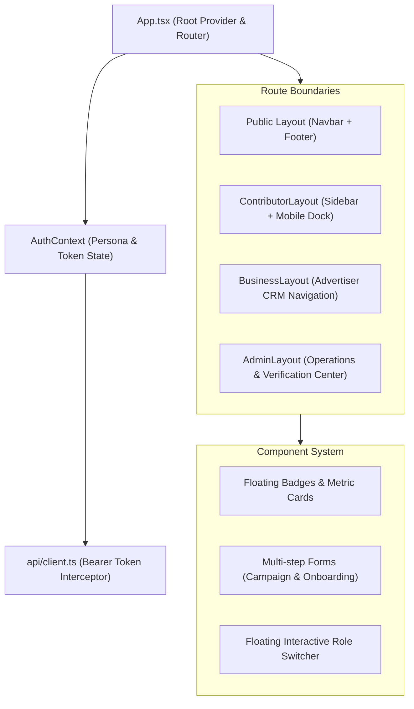

# BizNetwork Frontend Architecture Specification

## 1. Architectural Principles

BizNetwork's frontend is architected as a high-performance, mobile-first Single Page Application (SPA) leveraging React 19, TypeScript 5.8, and Tailwind CSS v4.



---

## 2. Directory Structure

```
frontend/src/
├── api/
│   └── client.ts              # Central Axios instance with authorization interceptor
├── brand.ts                   # Centralized color codes, typography, and copy tokens
├── components/
│   └── common/
│       ├── Navbar.tsx         # Deep Navy (#07182F) public sticky header
│       ├── Footer.tsx         # Comprehensive 5-column footer
│       └── RoleSwitcher.tsx   # Floating 1-click persona testing widget
├── context/
│   └── AuthContext.tsx        # Persona switching, token storage, and session sync
├── layouts/
│   ├── ContributorLayout.tsx  # Mobile-first navigation with 44px touch targets
│   ├── BusinessLayout.tsx     # Enterprise advertiser management shell
│   └── AdminLayout.tsx        # High-density operational management shell
├── pages/
│   ├── public/                # Landing, Tasks, HowItWorks, ForBusinesses, Trust, FAQ
│   ├── auth/                  # Login, ContributorSignup, BusinessSignup, Onboarding
│   ├── contributor/           # Dashboard, TaskDetail, SubmitProof, Wallet, MyTasks, Referrals
│   ├── business/              # Dashboard, CreateCampaignWizard
│   └── admin/                 # VerificationCenter, Fraud, Payouts, SuperAdmin
└── types/
    └── index.ts               # Strict TypeScript interfaces matching backend models
```

---

## 3. State Management & Authentication Flow

### 3.1 Authentication & Persona Switching
- `AuthContext.tsx` handles active user state, JWT / Sanctum bearer tokens, and instant role switching.
- **One-Click Persona Switcher**: In development and demonstration environments, the switcher allows switching between `contributor`, `business`, `moderator`, and `superadmin` with instant authorization state re-hydration.
- **Token Interception**:
  ```ts
  api.interceptors.request.use((config) => {
    const token = localStorage.getItem('biznetwork_token');
    if (token) {
      config.headers.Authorization = `Bearer ${token}`;
    }
    return config;
  });
  ```

### 3.2 Optimistic Updates & Local Cache
- Wallet balance mutations (e.g. withdrawal submissions) update client-side context optimistically while dispatching ledger transactions to the backend.

---

## 4. Design System & CSS Implementation

- **Tailwind CSS v4**: Utilizes `@tailwindcss/vite` without legacy PostCSS boilerplate.
- **Color Variables**: Defined in `src/index.css` and `src/brand.ts`:
  - `--brand-navy`: `#07182F`
  - `--brand-blue`: `#168BFF`
  - `--brand-purple`: `#7257FF`
  - `--brand-success`: `#16B364`
- **Component Styling**: Styled using atomic utility classes combined via `clsx` and `tailwind-merge` (`cn` helper).

---

## 5. Mobile-First Contributor Experience

1. **Touch Targets**: Minimum 44x44px hit targets across mobile action items.
2. **Bottom Navigation Bar**: Fixed bottom dock on mobile viewports displaying **Tasks**, **My Tasks**, **Wallet**, and **Profile**.
3. **Floating Metric Badges**: Floating cards (`Your Balance $28.40`, `Task Completed! +$0.50`, `New Task Available +$0.40`) calibrated to harmonize with human hero imagery.
4. **Offline Resilience**: API failure fallbacks present placeholder demo data if backend connection is temporarily unavailable.

---

## 6. Build & Performance Optimization

- **Chunk Splitting**: Production bundle optimized under `dist/` with gzip compression.
- **Type Checking**: Strict `tsc -b` execution with `verbatimModuleSyntax` and ES2023 target.
- **Bundle Footprint**: Main application code bundled at ~513 kB uncompressed (~143 kB gzip).
