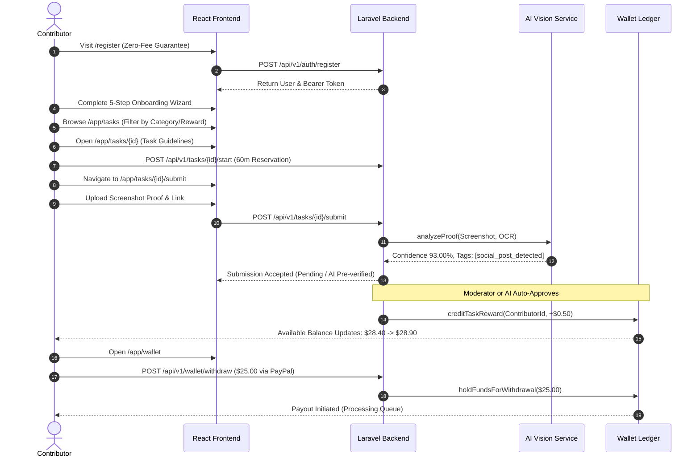
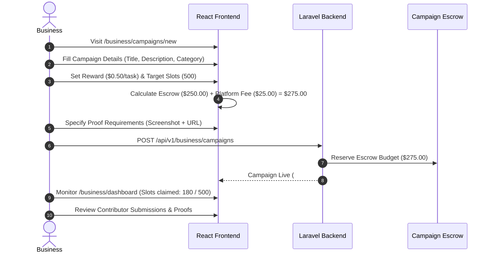
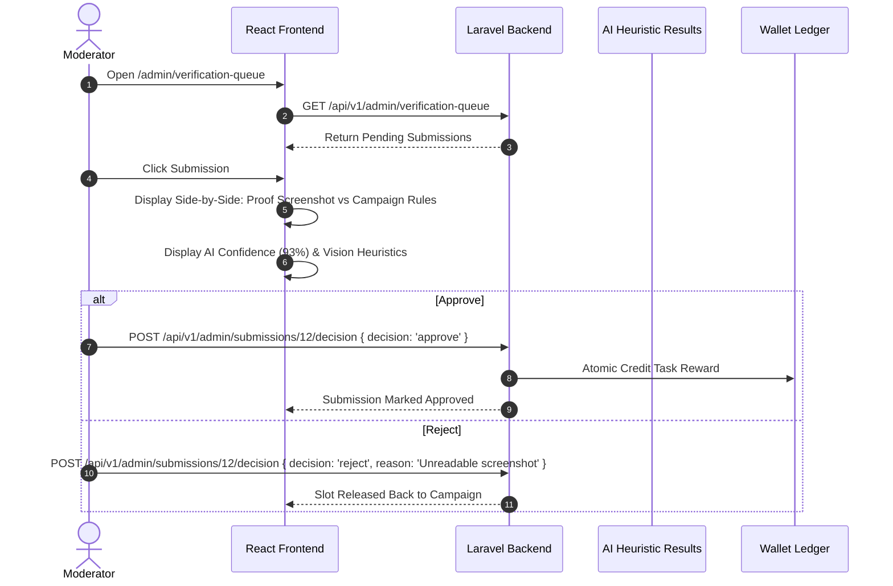

# BizNetwork User Flows & Journey Specifications

This document defines the end-to-end user journeys for the four platform roles: **Contributor**, **Business / Advertiser**, **Moderator**, and **Super Admin**.

---

## 1. Contributor Journey (Earning & Payout Flow)

### Key Contributor Steps:
1. **Discovery & Onboarding**: Zero registration fees; clear expectations on task verification.
2. **Task Marketplace**: Large cards, transparent reward amounts (`+$0.40`, `+$0.50`), estimated completion minutes, and difficulty tags.
3. **Task Claim**: Locks task slot for 60 minutes to prevent race conditions.
4. **Proof Upload**: Client-side drag-and-drop file preview + live AI confidence badge.
5. **Wallet Ledger**: Real-time balance review with line-item ledger records (`balance_before_cents`, `balance_after_cents`).
6. **Withdrawal**: Minimum \$5.00 threshold; validated against available funds.

---

## 2. Business / Advertiser Journey (Campaign Creation & Escrow)

### Key Business Steps:
1. **6-Step Creation Wizard**: Title & Goal -> Category -> Task Reward & Volume -> Instructions -> Proof Rules -> Summary & Escrow.
2. **Transparent Fee Structure**: 10% platform fee added to total rewards; 100% money-back guarantee on unclaimed slots.
3. **Real-time Analytics**: Conversion rates, verified slots, pending reviews, and spend tracking.

---

## 3. Moderator Journey (Verification & Quality Control)

---

## 4. Super Admin Journey (Governance & System Control)

1. **Feature Flag Management**:
   - Access `/superadmin` -> Feature Flags.
   - Live toggle `crypto_payouts`, `multi_level_affiliate`, or `ai_auto_approval`.
   - Backend persists state to `feature_flags` table with immediate propagation.
2. **Platform Financial Settings**:
   - Adjust `min_withdrawal_cents`, `platform_fee_percent`, and daily payout caps.
3. **Security & Audit Logs**:
   - Inspect administrative actions, IP addresses, timestamp telemetry, and anomalous transactions.
